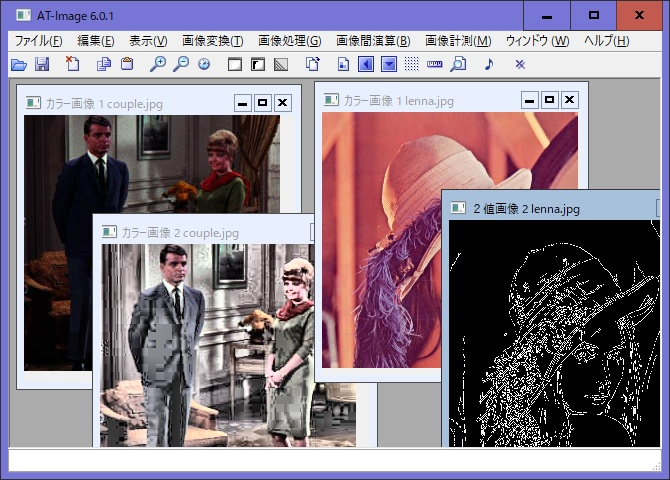

# AT-Imageについて
AT-Imageは、画像処理クラス（UOpenCV：PythonのOpenCVラッパー）のデバッグ用に開発したソフトウェアです。 
Photoshopや[paint.net](https://www.getpaint.net/)のような画像編集はできませんが、シェーディング補正やヒストグラム変換といった「画像処理」を行ことができます。 
近年、Deep Learning の発展によって画像処理技術は大きく変化しました。 
以前（従来）の手法は「古典画像処理」とも呼べるかもしれません。 
しかし、「古典」といっても不要になったわけではなく、技術の基礎として今後も活用され続けると思います。 
AT-Image は、「古典画像処理」を学ぶのにも適したソフトです。 
もともとは自分用に作りましたが、画像処理の勉強にも役立つと思い、フリーウェアとして公開することにしました。 

AT-Imageは、

* 画像の読み書き
	* Windows bitmaps、JPEG、Portable Network Graphics、WebP
* 画像変換
	* グレースケール変換、モノトーン変換、擬似カラー表示、色画像分離、２値化、フーリエ変換
* シェーディング補正</dt>
	* 黒基準画像シェーディング補正、白・黒基準画像シェーディング補正、凹凸係数シェーディング補正、モルフォロジー演算シェーディング補正
* ヒストグラム変換</dt>
	* コントラスト制限適応ヒストグラム平坦化、平坦化、正規化、拡張、伸張、反転、ネガポジ反転、平均と標準偏差を指定して変換、コントラスト明るさ変換
* 画像フィルタ</dt>
	* 単純平滑化、メディアンフィルタ、ガウシアンフィルタ、アンシャープフィルタ、バイラテラルフィルタ、エッジプレザービング、細部強調フィルタ、ゾーベルフィルタ、ラプラシアンフィルタ、空間フィルタ (たたみ込み演算)
* ルックアップテーブル</dt>
* モルフォロジー処理</dt>
* 輪郭化</dt>
	* Canny、findContours、モルフォロジー
* 円・線分検出</dt>
	* ハフ変換（円）、ハフ変換（線分）、Fast Line Detector（線分）、Line Segment Detector(線分)
* アート効果</dt>
	* 油絵調変換、水彩画調変換、鉛筆画調変換、ポスタリゼーション
* ２値画像処理</dt>
	* 固定閾値、自動閾値(大津の手法)、自動閾値(トライアングルアルゴリズム)、適応的２値化
* 逆FFT変換(マスク指定可能)</dt>
* 画像間演算</dt>
	* 重み付き加算、加算、減算、差の絶対値、大きい方、小さい方、AND、OR、XOR、透過
* 画像計測</dt>
	* ヒストグラム、水平方向周辺分布、垂直方向周辺分布、線上の分布
* ２値画像のラベリング処理</dt>

などができます。

# インストール

[Vectorサイト](https://www.vector.co.jp/soft/winnt/art/se336426.html)から、実行ファイルをダウンロードしてください。 
実行ファイルはサイズが大きいのでGitHubにアップロードできませんでした。

## ZIP版の場合
ダウンロードしたファイルを伸張し、適当なフォルダに入れてください。 
ディスクトップにショートカットを置くと便利でしょう。 
初期設定ファイル(ATImage.ini)に書き込み権限を与えてください。 
書き込み権限がない場合、ソフトウエアが終了できません。  

## インストーラー版の場合
インストーラーを実行してください。  
インストーラーは、[Inno Setup Compiler](https://jrsoftware.org/isdl.php) を利用して作成しました。  
インストール／アンインストールの際に、 ウイルス対策ソフトによっては、unins000.exe がウイルス （マルウエア）であるという警告が出ることがありますが、誤検知と思われます。 
unins000.exe について、Microsoft Defender と ウイルスバスターで検査しましたが、ウイルスではないという結果を得ています。(2023/06/13)

## ソースファイルの場合
ダウンロードしたファイルを伸張し、適当なフォルダに入れてください。
- Python 3.9
- opencv-python 4.5.5
- opencv-contrib-python 4.5.5
- matplotlib 3.5
- wxPython 4.1.1 (4.1.1でないとウインドウ整列メニューが英語になります。)

が必要です。実行時に足りないライブラリがあると言われたら、随時足してください。 
opencv-python , opencv-contrib-python のバージョンは揃える必要があります。その他のバージョンは適当でもかまわないのではないかと思います。 
初期設定ファイル(ATImage.ini)に書き込み権限を与えてください。書き込み権限がない場合、ソフトウエアが終了できません。 

# 使い方
こんな感じで使える、使えばわかる簡単なソフトです。 
 
AT-Imageは、画像の種類（カラー、白黒、２値、FFT処理、その他）によって メニューが異なります。 
画像の種類はウインドウのタイトルのところに出ています。

# ソースファイルについて
BSDライセンスです。 
好きに改造してください。 

# 制限事項
1.    GIF画像は読み込めません
1.    線分、円の検出はうまくいかないことがあります。
1.    カラー画像の、ヒストグラム変換、ルックアップテーブルは、輝度のみ処理します。＝色相や彩度は変更しません。
1.    シェーディング補正、画像フィルタ、モルフォロジー処理は、RGBそれぞれのチャンネルで処理します。
1.    サポートは行いません。自己責任で使う事ができる人のみ使用してください。(無保証)
1.    メールでの質問にも答えることができないと思います。
1.    動作確認をしていますが、本プログラムにていかなる問題が発生しても作者は一切の責任を負いません。(作者の免責)

# ライセンスについて
AT-ImageはBSDライセンスとします。  
**AT-Image ver.6  Copyright (c) 2022,23 ENDOU Yoshimiti All rights reserved.** 
ソースコード形式かバイナリ形式か、変更するかしないかを問わず、以下の条件を満たす場合に限り、再頒布および使用が許可されます。 
* ソースコードを再頒布する場合、上記の著作権表示、本条件一覧、および下記免責条項を含めること。 
* バイナリ形式で再頒布する場合、頒布物に付属のドキュメント等の資料に、上記の著作権表示、本条件一覧、および下記免責条項を含めること。 
* 書面による特別の許可なしに、本ソフトウェアから派生した製品の宣伝または販売促進に、著作権者の名前を使用してはならない。 

本ソフトウェアは、著作権者によって「現状のまま」提供されており、明示黙示を問わず、商業的な使用可能性、および特定の目的に対する適合性に関する暗黙の保証も含め、またそれに限定されない、いかなる保証もありません。著作権者は、損害発生の事由と原因いかんを問わず、かつ責任の根拠が契約であるか厳格責任であるか（過失その他の）不法行為であるかを問わず、仮にそのような損害が発生する可能性を知らされていたとしても、本ソフトウェアの使用によって発生した（代替品または代用サービスの調達、使用の喪失、データの喪失、利益の喪失、業務の中断も含め、またそれに限定されない）直接損害、間接損害、偶発的な損害、特別損害、懲罰的損害、または結果損害について、一切責任を負わないものとします。 
***
